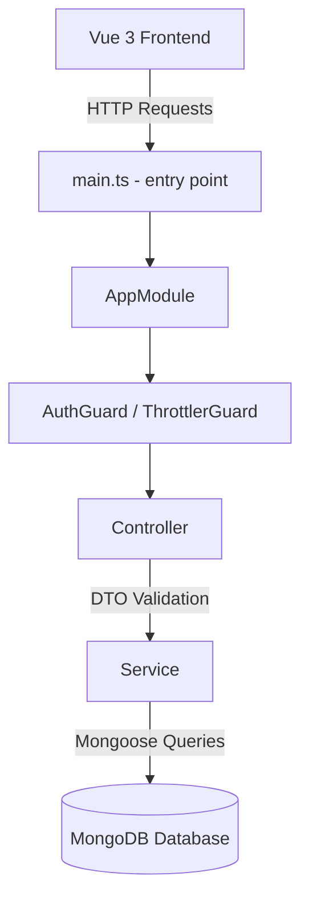
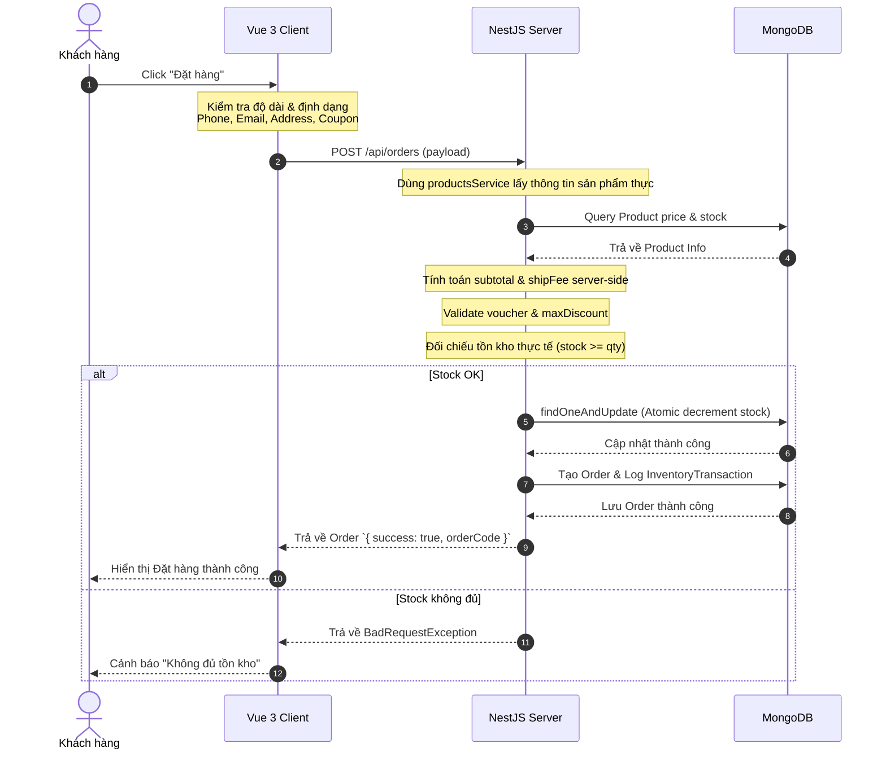

# 📚 TRƯỜNG THÀNH BOOKSTORE — TÀI LIỆU DỰ ÁN CHI TIẾT
*(Tài liệu dành cho AI và Nhà phát triển để đọc hiểu nhanh toàn bộ hệ thống)*

Hệ thống bán hàng và quản trị Trường Thanh Bookstore được xây dựng trên mô hình Client-Server hiện đại, đáp ứng đầy đủ các tiêu chuẩn bảo mật, tối ưu hóa hiệu năng, và trải nghiệm người dùng (UX) cao cấp.

---

## 📂 1. SƠ ĐỒ CẤU TRÚC THƯ MỤC DỰ ÁN (PROJECT STRUCTURE)

### 1.1. Cấu trúc Backend (NestJS BE)
```
backend/
├── src/
│   ├── main.ts                        # Khởi tạo ứng dụng NestJS, thiết lập CORS, Pipes, Filters
│   ├── app.module.ts                  # Root Module kết nối Mongoose, Config và Throttler (Rate Limit)
│   ├── app.controller.ts              # Controller cho các tác vụ hệ thống (như check health)
│   ├── common/                        # Chứa các tiện ích dùng chung
│   │   ├── decorators/                # Decorator tùy chỉnh (ví dụ: @GetUser lấy thông tin user từ JWT)
│   │   ├── dto/                       # DTO dùng chung cho phân trang (PaginationDto)
│   │   ├── enums/                     # Định nghĩa Enum hệ thống (UserRole, OrderStatus, DiscountType)
│   │   ├── filters/                   # HttpExceptionFilter chuẩn hóa cấu trúc lỗi API trả về
│   │   ├── guards/                    # Guard xác thực quyền (OptionalJwtGuard)
│   │   └── interceptors/              # TransformInterceptor bọc kết quả API thành { statusCode, message, data }
│   ├── modules/                       # Các Module Nghiệp vụ chính
│   │   ├── auth/                      # Đăng ký, đăng nhập, JWT, mã hóa bcrypt và làm sạch profile
│   │   ├── categories/                # Quản lý danh mục sản phẩm (hỗ trợ phân cấp Cha - Con)
│   │   ├── customers/                 # Quản lý thông tin khách hàng (phần Admin hiển thị)
│   │   ├── inventory/                 # Quản lý nhập/xuất/điều chỉnh kho, ghi log giao dịch
│   │   ├── landing-pages/             # Thiết lập và tuỳ biến trang đích khuyến mãi (Landing Pages)
│   │   ├── orders/                    # Xử lý đơn hàng, khoá giá, tính ship server-side, kiểm kho nguyên tử
│   │   ├── products/                  # Quản lý sách/văn phòng phẩm & lưu trữ bình luận (Reviews) dưới DB
│   │   ├── promotions/                # Hệ thống mã giảm giá (voucher), chặn dùng trùng, giới hạn tối đa
│   │   └── reports/                   # Thống kê doanh thu theo múi giờ địa phương, báo cáo Dashboard
│   └── seeds/                         # Dữ liệu mẫu (Seed Data) dùng để khởi tạo nhanh hệ thống
├── package.json                       # Quản lý thư viện phụ thuộc của NestJS
└── tsconfig.json                      # Cấu hình TypeScript Compiler cho Backend
```

### 1.2. Cấu trúc Frontend (Vue 3 FE)
```
frontend/
├── public/
│   ├── robots.txt                     # Chỉ dẫn thu thập thông tin của Googlebot (block /admin, /login, /register)
│   ├── sitemap.xml                    # Sơ đồ trang web động chuẩn SEO cho các đường dẫn chính
│   └── manifest.json                  # Cấu hình PWA ứng dụng web tiến trình (Progressive Web App)
├── src/
│   ├── main.ts                        # Điểm khởi chạy ứng dụng Vue 3, nạp router, pinia, toast
│   ├── App.vue                        # Root Component chính chứa <router-view />
│   ├── style.css                      # Chứa Tailwind CSS và custom styles
│   ├── assets/                        # Tài nguyên tĩnh (ảnh danh mục, logo, background sale)
│   ├── components/                    # Component dùng lại:
│   │   ├── ProductCard.vue            # Card hiển thị thông tin sản phẩm
│   │   ├── ProfileModal.vue           # Modal chỉnh sửa trang cá nhân
│   │   ├── Breadcrumb.vue             # Component điều hướng phân cấp (chuẩn microdata SEO)
│   │   └── CategoryProductSection.vue # Section danh mục sản phẩm trang chủ tái sử dụng
│   ├── layouts/                       # Layout bao bọc giao diện (CustomerLayout, AdminLayout)
│   ├── composables/                   # Khai báo Composition API dùng chung:
│   │   ├── useScrollReveal.ts         # Hiệu ứng cuộn hiển thị mượt mà
│   │   ├── useSeoMeta.ts              # Composable tối ưu SEO meta động per-page
│   │   └── useStructuredData.ts       # Sinh JSON-LD Organization/Product schemas cho Google search
│   ├── pages/                         # Chứa các trang View của hệ thống
│   │   ├── NotFound.vue               # Trang thông báo lỗi 404
│   │   └── customer/                  # Giao diện phía khách hàng:
│   │       ├── Home.vue               # Trang chủ (đã tinh giản thông qua CategoryProductSection)
│   │       ├── Info.vue               # Trang điều khoản & chính sách (bảo mật, vận chuyển, đổi trả, HD mua hàng)
│   │       ├── ProductDetail.vue      # Chi tiết sản phẩm (kèm Schema & Breadcrumbs)
│   │       ├── ProductList.vue        # Danh sách lọc sản phẩm (kèm Breadcrumbs)
│   │       └── ...
│   │   └── admin/                     # Giao diện phía quản trị (Dashboard, Inventory, Orders, Promotions,...)
│   ├── router/                        # Cấu hình định tuyến Vue Router, Lazy Loading và Guards
│   ├── services/                      # Cấu hình Axios Client kết nối API Backend
│   ├── stores/                        # Pinia Stores quản lý state tập trung (auth.ts, cart.ts)
│   ├── types/                         # Định nghĩa kiểu dữ liệu TypeScript (Product, Order, User,...)
│   └── utils/                         # Hàm trợ giúp (formatCurrency, mã hóa XOR-Base64 localStorage, helper date)
├── package.json                       # Quản lý thư viện phụ thuộc của Frontend
├── vercel.json                        # Cấu hình định tuyến và URL rewrites khi deploy lên Vercel
└── vite.config.ts                     # File cấu hình đóng gói và tối ưu của Vite
```

---

## 🛠 2. CÔNG NGHỆ SỬ DỤNG (TECH STACK)
*   **Backend (Server)**:
    *   **Framework**: [NestJS](https://nestjs.com/) (Node.js framework)
    *   **Cơ sở dữ liệu**: MongoDB
    *   **ODM**: Mongoose
    *   **Thư viện hỗ trợ**: `@nestjs/jwt`, `@nestjs/throttler` (Rate limit), `bcrypt` (Mã hóa mật khẩu), `class-validator` & `class-transformer` (Validate DTO).
*   **Frontend (Client)**:
    *   **Framework**: [Vue 3](https://vuejs.org/) (SFC - Single File Component, Composition API)
    *   **Bundler**: Vite
    *   **State Management**: Pinia
    *   **Routing**: Vue Router
    *   **Styling**: TailwindCSS
    *   **Thư viện vẽ biểu đồ**: Chart.js / Vue-Chartjs
    *   **Thông báo UI**: Vue-Toastification

---

## 🏗 3. KIẾN TRÚC HỆ THỐNG & ĐIỀU PHỐI (ARCHITECTURE)

Hệ thống tuân thủ kiến trúc phân tầng chuẩn của NestJS:


*   **Global Filters & Pipes**:
    *   `HttpExceptionFilter`: Đồng bộ hóa định dạng lỗi trả về từ API cho toàn hệ thống.
    *   `TransformInterceptor`: Chuẩn hóa dữ liệu trả về theo form `{ statusCode, message, data }`.
    *   `ValidationPipe`: Tự động loại bỏ các field lạ (`whitelist: true`) và bắt lỗi dữ liệu đầu vào (`class-validator`).

---

## 🗄 4. THIẾT KẾ CƠ SỞ DỮ LIỆU (DATABASE SCHEMAS)

### 4.1. User Schema (`users`)
Quản lý tài khoản khách hàng, nhân viên, và quản trị viên.
*   `fullName`: Chuỗi (Bắt buộc).
*   `email`: Chuỗi (Duy nhất, bắt buộc, định dạng email).
*   `password`: Chuỗi (Lưu hash bcrypt).
*   `phone`: Chuỗi (10 chữ số, bắt đầu bằng 0).
*   `role`: Enum (`CUSTOMER`, `STAFF`, `ADMIN`).
*   `avatar`: Chuỗi (URL ảnh từ Cloudinary).
*   `isDeleted`: Boolean (Hỗ trợ soft-delete).

### 4.2. Product Schema (`products`)
*   `name`: Chuỗi (Bắt buộc).
*   `slug`: Chuỗi (Duy nhất, tạo tự động kèm đuôi random 4 kí tự chống trùng lặp).
*   `description`: Chuỗi.
*   `price`: Số (Giá bán gốc).
*   `discountPrice`: Số (Giá sau giảm, mặc định 0).
*   `stock`: Số (Số lượng tồn kho thực tế).
*   `images`: Mảng Chuỗi.
*   `brand`: Chuỗi.
*   `sku`: Chuỗi (Mã sản phẩm duy nhất).
*   `rating`: Số (Trung bình đánh giá từ 1 đến 5).
*   `sold`: Số (Số lượng đã bán).
*   `status`: Enum (`ACTIVE`, `INACTIVE`).
*   `category`: ObjectId ref `categories`.
*   `isFeatured`: Boolean.
*   `isDeleted`: Boolean.

### 4.3. Review Schema (`reviews`)
Lưu trữ đánh giá sản phẩm của người dùng và đã được chuyển thành persistence lưu trong DB.
*   `product`: ObjectId ref `products`.
*   `user`: ObjectId ref `users`.
*   `name`: Chuỗi.
*   `rating`: Số (1 đến 5).
*   `content`: Chuỗi (Bắt buộc).

### 4.4. Category Schema (`categories`)
*   `name`: Chuỗi.
*   `parentId`: ObjectId (Tự liên kết cấp danh mục cha - con).
*   `image`: Chuỗi.
*   `slug`: Chuỗi.
*   `isDeleted`: Boolean.

### 4.5. Order Schema (`orders`)
*   `orderCode`: Chuỗi (Mã đơn hàng duy nhất dạng `TTB-XXXXXX`).
*   `customer`: ObjectId ref `users` (Optional - Hỗ trợ Guest Checkout).
*   `customerName`: Chuỗi.
*   `email`: Chuỗi.
*   `phone`: Chuỗi.
*   `shippingAddress`: Chuỗi.
*   `items`: Mảng sub-document:
    *   `product`: ObjectId ref `products`.
    *   `name`: Chuỗi.
    *   `quantity`: Số.
    *   `price`: Số (Giá được khóa tại thời điểm đặt đơn).
    *   `image`: Chuỗi.
*   `subtotal`: Số.
*   `shippingFee`: Số.
*   `discountAmount`: Số.
*   `total`: Số.
*   `promotionCode`: Chuỗi.
*   `paymentMethod`: Enum (`COD`, `BANK_TRANSFER`, `EWALLET`).
*   `paymentStatus`: Enum (`PENDING`, `PAID`).
*   `orderStatus`: Enum (`PENDING`, `CONFIRMED`, `SHIPPING`, `COMPLETED`, `CANCELLED`).
*   `notes`: Chuỗi.

### 4.6. Inventory & InventoryTransaction (`inventories`, `inventorytransactions`)
*   **Inventory**: Lưu trữ và cập nhật trạng thái kho.
    *   `product`: ObjectId ref `products`.
    *   `currentStock`: Số.
    *   `minStock`: Số (Mặc định 10 để kích hoạt cảnh báo Low Stock).
    *   `status`: Enum (`IN_STOCK`, `LOW_STOCK`, `OUT_OF_STOCK`).
*   **InventoryTransaction**: Nhật ký điều chỉnh kho.
    *   `product`: ObjectId ref `products`.
    *   `type`: Enum (`IMPORT`, `EXPORT`, `ADJUST`).
    *   `quantity`: Số.
    *   `note`: Chuỗi.
    *   `createdBy`: ObjectId ref `users`.

---

## 💡 5. CÁC MODULE CHI TIẾT & LOGIC BÊN TRONG

### 5.1. Module Xác thực (Authentication)
*   **Token Expiry & Security**: JWT Access Token sử dụng thời gian hết hạn (`expiresIn: '7d'`). 
*   **LocalStorage Encryption**: Frontend sử dụng hàm mã hóa và giải mã `encryptToken()` / `decryptToken()` khi lưu dữ liệu nhạy cảm (`token`, `user`) vào `localStorage` của trình duyệt nhằm ngăn chặn lộ thông tin dạng thô.
*   **Profile Clean**: API `/api/auth/me` tự động loại bỏ trường hash mật khẩu `password` bằng cách destructure trả về (`const { password, ...safeUser } = user`).

### 5.2. Module Đặt hàng & Thanh toán (Checkout & Order)
*   **Recalculation on Backend (Chống Price Manipulation)**: Khi khách hàng tạo đơn hàng, backend **không tin tưởng** vào giá tiền và phí vận chuyển gửi lên từ client.
    1.  Duyệt qua mảng `items` gửi lên, dùng `productsService.findById(item.product)` để lấy thông tin sản phẩm và giá thực trực tiếp từ Database.
    2.  Tính toán lại `subtotal` bằng giá thật này.
    3.  Tính toán lại `shippingFee` dựa trên điều kiện: Đơn hàng `>= 299.000đ` được miễn phí vận chuyển, ngược lại phí ship là `30.000đ`.
    4.  Áp dụng voucher (nếu có) để tính lại `discountAmount`.
    5.  Tính ra tổng tiền cuối cùng `total = subtotal + shippingFee - discount`.
*   **Atomic Stock Check & Deduct**: Để ngăn chặn race condition khiến kho bị âm khi nhiều người đặt hàng cùng lúc, hệ thống sử dụng truy vấn nguyên tử (atomic query) của MongoDB:
    ```typescript
    const updated = await this.productModel
      .findOneAndUpdate(
        { _id: id, stock: { $gte: quantity } }, // Kiểm tra stock lớn hơn hoặc bằng lượng mua
        { $inc: { stock: -quantity } },
        { new: true },
      ).exec();
    ```
    Nếu không tìm thấy hoặc số lượng tồn không đủ, trả về `BadRequestException` lập tức để huỷ quá trình tạo đơn.
*   **Ownership Check on Cancellation**: Người dùng chỉ được hủy đơn hàng của chính họ. Controller kiểm tra tính sở hữu trước khi cập nhật trạng thái đơn:
    ```typescript
    if (order.customer.toString() !== req.user._id && req.user.role !== UserRole.ADMIN) {
      throw new ForbiddenException('Bạn không có quyền huỷ đơn hàng này');
    }
    ```

### 5.3. Module Khuyến mại & Voucher (Promotions)
*   **Max Discount Capping**: Hỗ trợ giảm giá theo phần trăm kèm giới hạn tối đa (`maxDiscount`). 
    ```typescript
    if (promo.discountType === DiscountType.PERCENT) {
      discount = Math.floor((orderTotal * promo.discountValue) / 100);
      if (promo.maxDiscount && promo.maxDiscount > 0) {
        discount = Math.min(discount, promo.maxDiscount);
      }
    }
    ```
*   **Usage Frequency Check**: Ngăn chặn người dùng sử dụng cùng 1 coupon cho nhiều đơn hàng:
    Hệ thống kiểm tra xem user hiện tại đã có đơn hàng nào không bị hủy (`status != CANCELLED`) đã dùng mã này chưa.

### 5.4. Module Tìm kiếm & An toàn (Search & ReDoS Protection)
*   **ReDoS Prevention**: Người dùng nhập chuỗi tìm kiếm dài có thể dẫn đến đứng CPU server nếu sử dụng Regex không an toàn. Hệ thống giới hạn chuỗi tìm kiếm đầu vào tối đa là 100 ký tự:
    `const safeQ = q.substring(0, 100);`
*   **Diacritic-Insensitive Matching**: Tạo một bản đồ ký tự có dấu (Tiếng Việt) sang không dấu để biến chuỗi nhập thành một Regex Pattern linh hoạt, cho phép tìm kiếm bất kể người dùng gõ có dấu hay không dấu.

### 5.5. Module Báo cáo (Reports)
*   **Timezone Offset Fix**: Để đảm bảo báo cáo doanh thu theo ngày là chính xác tuyệt đối mà không bị lệch múi giờ UTC, backend chuyển đổi tham số lọc ngày cụ thể:
    ```typescript
    const start = new Date(startDate);
    start.setHours(0, 0, 0, 0); // Bắt đầu ngày theo giờ địa phương
    const end = new Date(endDate);
    end.setHours(23, 59, 59, 999); // Kết thúc ngày theo giờ địa phương
    ```
    Phía client cũng lấy giá trị thông qua hàm bổ trợ `getLocalDateString(date)` thay vì `date.toISOString()`.

---

## 🔒 6. CÁC BIỆN PHÁP BẢO MẬT & TỐI ƯU ĐÃ TRIỂN KHAI

1.  **Rate Limiting**: Giới hạn tần suất gửi yêu cầu lên các API xác thực (Login/Register) bằng `@nestjs/throttler` (Mặc định 100 requests/phút).
2.  **CORS Security**: Hỗ trợ cấu hình đa domain động qua biến môi trường `FRONTEND_URL` (hỗ trợ phân tách bằng dấu phẩy) thay vì dùng wildcard `*`.
3.  **Input Sanitation**: Bắt buộc mọi API đầu vào phải được định nghĩa bằng class DTO và đi qua ValidationPipe của NestJS để tránh SQL/NoSQL Injection qua các payload bất thường.
4.  **UI Performance**: Toàn bộ hệ thống routes ở Frontend đều được cấu hình tải chậm (Lazy Loading) giúp giảm dung lượng bundle tải về ban đầu của người dùng.
5.  **Dynamic SEO & Structured Data**: Triển khai `useSeoMeta` cập nhật meta tags động, đồng bộ hóa `robots.txt`, `sitemap.xml`, PWA `manifest.json`, kết hợp cấu trúc JSON-LD `Organization` và `Product` schemas nhằm gia tăng tỷ lệ hiển thị trên Google.
6.  **Token XOR Obfuscation**: Mã hóa token/profile lưu trữ ở `localStorage` bằng phương pháp XOR-obfuscation kết hợp Base64, tích hợp bộ giải mã tương thích ngược để bảo vệ phiên đăng nhập cũ của khách hàng.
7.  **Modular Section Rendering**: Tái cấu trúc mã nguồn trang chủ bằng `CategoryProductSection.vue` giúp giảm số dòng code từ ~2200 dòng xuống còn dưới 1000 dòng, tăng tốc độ render.
8.  **Backend Exception Logging**: Bổ sung ghi log Stack Trace tự động cho mọi ngoại lệ 500 ở backend giúp giảm thời gian debug và nâng cấp độ tin cậy của dịch vụ.

---

## 🔄 7. LUỒNG NGHIỆP VỤ CHÍNH (CORE BUSINESS WORKFLOWS)

### 7.1. Luồng Thanh Toán (Checkout & Order Flow)


---

## 📡 8. DANH SÁCH API ENDPOINTS CHÍNH (MAIN API ROUTES)

| Nhóm chức năng | Phương thức | API Route | Quyền truy cập | Mô tả |
|----------------|-------------|-----------|----------------|-------|
| **Xác thực** | `POST` | `/api/auth/register` | Public | Đăng ký tài khoản khách hàng mới |
| | `POST` | `/api/auth/login` | Public | Đăng nhập hệ thống (giới hạn rate limit) |
| | `GET` | `/api/auth/me` | Auth (User) | Lấy thông tin cá nhân (lọc mật khẩu) |
| | `PUT` | `/api/auth/profile` | Auth (User) | Cập nhật tên, sđt, ảnh đại diện |
| **Sản phẩm** | `GET` | `/api/products` | Public | Tìm kiếm, phân trang, lọc sản phẩm |
| | `GET` | `/api/products/:id` | Public | Xem thông tin chi tiết một sản phẩm |
| | `POST` | `/api/products` | Admin / Staff | Tạo sản phẩm mới kèm tạo kho tự động |
| | `PUT` | `/api/products/:id` | Admin / Staff | Cập nhật thông tin chi tiết sản phẩm |
| | `DELETE` | `/api/products/:id` | Admin / Staff | Soft-delete (xóa mềm) sản phẩm |
| | `GET` | `/api/products/:id/reviews`| Public | Xem bình luận đánh giá của sản phẩm |
| | `POST` | `/api/products/:id/reviews`| Auth (User) | Thêm đánh giá mới lưu vào database |
| **Đơn hàng** | `POST` | `/api/orders` | Public / Guest | Tạo đơn hàng mới (tự tính giá & ship ở server) |
| | `GET` | `/api/orders/my-orders` | Auth (User) | Xem lịch sử đơn hàng cá nhân |
| | `GET` | `/api/orders/:id` | Auth (User) | Xem chi tiết đơn hàng |
| | `POST` | `/api/orders/:id/cancel`| Auth (User) | Hủy đơn hàng (kiểm tra quyền sở hữu) |
| | `GET` | `/api/orders` | Admin / Staff | Quản trị danh sách toàn bộ đơn hàng |
| | `PUT` | `/api/orders/:id/status`| Admin / Staff | Cập nhật trạng thái đơn / trạng thái thanh toán |
| **Tồn kho** | `GET` | `/api/inventory` | Admin / Staff | Xem toàn bộ kho hàng và trạng thái |
| | `GET` | `/api/inventory/low` | Admin / Staff | Xem danh sách hàng sắp hết / hết sạch |
| | `POST` | `/api/inventory/import` | Admin / Staff | Nhập kho (cộng stock) |
| | `POST` | `/api/inventory/export` | Admin / Staff | Xuất kho (trừ stock) |
| **Mã giảm giá**| `POST` | `/api/promotions/apply` | Public / Guest | Áp dụng và tính toán thử voucher |
| | `GET` | `/api/promotions/active`| Public | Lấy danh sách coupon đang hoạt động |
| **Báo cáo** | `GET` | `/api/reports/dashboard`| Admin / Staff | Lấy tổng quan thống kê dashboard |
| | `GET` | `/api/reports/revenue` | Admin / Staff | Báo cáo doanh thu theo dải ngày (local time) |
| **Giám sát** | `GET` | `/api/health` | Public | Endpoint kiểm tra sức khỏe của server (cho Cron-job) |

---

## 🚀 9. HƯỚNG DẪN CÀI ĐẶT & CHẠY DỰ ÁN (SETUP & RUNNING)

### 9.1. Cài đặt Biến Môi trường (Environment Variables)

*   **Backend (`backend/.env`)**:
    ```env
    MONGODB_URI=mongodb://localhost:27017/truongthanh  # Chuỗi kết nối MongoDB
    JWT_SECRET=your_jwt_secret_key_here               # Khóa bí mật dùng ký token
    JWT_EXPIRES_IN=7d                                  # Thời gian hết hạn JWT token
    PORT=3000                                          # Cổng khởi chạy Backend
    FRONTEND_URL=http://localhost:5173                 # Origin được cấu hình CORS
    CLOUDINARY_CLOUD_NAME=your_cloudinary_cloud_name
    CLOUDINARY_API_KEY=your_cloudinary_api_key
    CLOUDINARY_API_SECRET=your_cloudinary_api_secret
    ```
*   **Frontend**: Endpoint kết nối được định nghĩa trong `frontend/src/utils/api.ts` (mặc định trỏ đến `http://localhost:3000/api`).

### 9.2. Lệnh Khởi chạy nhanh (Quick Start Commands)

#### 1. Khởi động Backend (NestJS Server)
```bash
cd backend
npm install
# Chạy seed để tạo tài khoản admin (admin@truongthanh.vn / Admin@123456) và data mẫu
npm run seed
# Chạy server ở chế độ phát triển
npm run start:dev
```

#### 2. Khởi động Frontend (Vue 3 Client)
```bash
cd frontend
npm install
# Chạy client ở chế độ phát triển (Vite)
npm run dev
# Build ra mã nguồn tối ưu cho production
npm run build
```

### 9.3. Hướng dẫn Triển khai Production (Deployment Guide)

#### 1. Triển khai Backend lên Render (Web Service)
- **Chuẩn bị**: Đăng ký MongoDB Atlas và thêm địa chỉ IP `0.0.0.0/0` vào IP Access List trên MongoDB Atlas Dashboard để cho phép Render kết nối đến Database từ bất cứ đâu.
- **Tạo Web Service**:
  - Chọn Repository dự án trên Render.
  - Cấu hình:
    - **Name**: `truong-thanh-bookstore-backend`
    - **Language**: `Node` (hoặc sử dụng `Docker` qua Dockerfile đã viết sẵn)
    - **Root Directory**: `backend`
    - **Build Command**: `npm install && npm run build`
    - **Start Command**: `npm run start:prod`
  - **Environment Variables**: Thêm đầy đủ các biến môi trường sau trên Render Dashboard:
    - `PORT`: `3000` (Render tự cấu hình cổng ngoài, nhưng server chạy cổng này nội bộ)
    - `MONGODB_URI`: Chuỗi kết nối MongoDB Atlas (dạng `mongodb+srv://...`)
    - `JWT_SECRET`: Khóa bảo mật ký token (nên đặt ngẫu nhiên và phức tạp)
    - `JWT_EXPIRES_IN`: `7d`
    - `FRONTEND_URL`: URL trang Frontend sau khi deploy trên Vercel (ví dụ: `https://truong-thanh-store.vercel.app`) để cấu hình CORS.
    - `CLOUDINARY_CLOUD_NAME`, `CLOUDINARY_API_KEY`, `CLOUDINARY_API_SECRET`: Các khóa tài khoản Cloudinary để lưu ảnh đại diện.
    - `GEMINI_API_KEY` (Tùy chọn): API key cho Gemini AI tạo landing page.
    - `GOOGLE_SHEET_WEBAPP_URL` (Tùy chọn): URL Script WebApp để đồng bộ đơn hàng sang Google Sheets.

#### 2. Thiết lập Cron-job giữ Backend hoạt động liên tục
Vì Render Free Tier tự động chuyển sang chế độ ngủ (sleep) sau 15 phút không nhận được yêu cầu nào, lượt truy cập đầu tiên sau đó sẽ mất khoảng 30-50 giây để khởi động lại server.
- **Giải pháp**: Thiết lập một Cron-job định kỳ để gửi request kích hoạt tới backend.
- **Cách thực hiện**:
  - Sử dụng dịch vụ cron-job miễn phí như [cron-job.org](https://cron-job.org) hoặc UptimeRobot.
  - Tạo một cron-job mới trỏ đến địa chỉ: `https://<YOUR_RENDER_BACKEND_URL>/api/health`.
  - Đặt lịch chạy: Cứ mỗi **10 - 14 phút** (lặp lại liên tục).
  - Endpoint `/api/health` phản hồi siêu nhanh mà không truy vấn cơ sở dữ liệu, giữ cho Render Backend hoạt động 24/7 một cách nhẹ nhàng.

#### 3. Triển khai Frontend lên Vercel
- **Tạo project trên Vercel**:
  - Kết nối Vercel với kho mã nguồn GitHub của bạn.
  - Chọn dự án `truong_thanh_store`.
  - Cấu hình dự án:
    - **Framework Preset**: `Vite`
    - **Root Directory**: `frontend`
    - **Build Command**: `npm run build`
    - **Output Directory**: `dist`
  - **Environment Variables**:
    - Thêm biến `VITE_API_URL` trỏ về địa chỉ Render Backend (ví dụ: `https://your-backend.onrender.com/api`).
- **Lưu ý**: Tệp `frontend/vercel.json` đã được cấu hình tự động để kích hoạt chế độ URL sạch và định tuyến toàn bộ yêu cầu về `index.html`, tránh lỗi `404 Not Found` khi F5 tải lại các trang con của Vue Router.

---

## 📜 10. LỊCH SỬ SỬA LỖI QA (QA BUG FIX HISTORY)
*(Bản tóm tắt lịch sử 26 lỗi đã được giải quyết triệt để)*

1.  **C01 (Hủy đơn hàng)**: Ràng buộc kiểm tra quyền sở hữu đơn hàng để khách hàng không hủy nhầm/hủy chéo của người khác.
2.  **C02 (Bảo vệ API)**: Thêm JWT Auth Guard cho endpoint xem thông tin chi tiết đơn hàng.
3.  **C03 (Chống gian lận giá)**: Loại bỏ việc tin tưởng giá tiền gửi lên từ client. Backend truy vấn giá thật trực tiếp từ DB.
4.  **C04 (Tránh race condition)**: Dùng MongoDB atomic update `stock: { $gte: quantity }` trong hàm `deductStock()` giúp ngăn chặn tình trạng quá bán/âm kho.
5.  **C05 (CORS đa domain)**: Chuyển đổi CORS thành danh sách động cho phép nhiều domain truy cập thay vì sử dụng wildcard `*`.
6.  **H01 (Check stock trước)**: Phía client kiểm tra tồn kho bằng API trước khi chuyển qua bước thanh toán.
7.  **H02 (Trần giảm giá)**: Thêm trường `maxDiscount` để giới hạn số tiền được giảm tối đa của voucher giảm giá theo `%`.
8.  **H03 (Tính ship server-side)**: Phí ship được tự động tính hoàn toàn ở backend để tránh khách hàng tự chỉnh phí ship về `0đ`.
9.  **H04 (Rate Limiting)**: Áp dụng `@nestjs/throttler` bảo vệ API Auth chống tấn công Brute-force.
10. **H05 (JWT Hết hạn)**: Bổ sung cấu hình `expiresIn: '7d'` cho JWT token để tránh token tồn tại mãi mãi.
11. **H06 (Mã hóa localStorage)**: Mã hóa token và profile lưu ở trình duyệt để tránh đọc trộm dữ liệu nhạy cảm.
12. **H07 (Rò rỉ hash)**: Xóa trường mật khẩu `password` khỏi kết quả trả về của API getProfile.
13. **M01 (Bình luận sản phẩm)**: Chuyển toàn bộ bình luận từ localStorage ở client về lưu trữ đồng bộ dưới MongoDB database.
14. **M02 (Giới hạn coupon)**: Kiểm tra lịch sử mua hàng, mỗi khách hàng chỉ được dùng 1 mã voucher duy nhất một lần.
15. **M03 (Discount logic)**: Sửa logic `discountPrice` để xử lý đúng trường hợp sản phẩm giảm giá về `0đ` hoặc không giảm giá.
16. **M04 (Chống ReDoS)**: Cắt chuỗi tìm kiếm về tối đa 100 ký tự trước khi chạy Regex để phòng ngừa sập CPU server.
17. **M05 (Loading indicators)**: Thêm khung xương (Skeleton loaders) khi đang tải dữ liệu danh mục ở trang chủ.
18. **M06 (Tối ưu LocalStorage)**: Chỉ lưu thông tin cơ bản của sản phẩm trong giỏ hàng để tránh tràn bộ nhớ trình duyệt.
19. **M07 (Validation)**: Validate định dạng 10 số của số điện thoại phía backend qua DTO.
20. **L01 (Phương thức thanh toán)**: Sửa lỗi hiển thị và chuẩn hoá text phương thức "Ví điện tử" cho EWALLET ở trang khách hàng và admin.
21. **L02 (Redirect đăng xuất)**: Tự động chuyển hướng về trang `/login` sau khi đăng xuất.
22. **L03 (Dropdown thông báo)**: Hoàn thiện dropdown quả chuông hiển thị thông báo chào mừng cho khách hàng.
23. **L04 (Responsive Admin)**: Sửa giao diện Admin Layout bị tràn màn hình trên mobile (hỗ trợ đóng mở sidebar, backdrop mờ).
24. **L05 (Trùng lặp slug)**: Thêm hậu tố ngẫu nhiên 4 ký tự vào slug khi tạo sản phẩm để tránh trùng link URL.
25. **L06 (Dọn dẹp Console)**: Chuyển đổi toàn bộ lệnh debug `console.log` và `console.error` của server sang NestJS `Logger`.
26. **Deploy Setup**: Thêm `/api/health` cho Render, cấu hình `vercel.json` định tuyến cho Vercel FE, nới lỏng CORS hỗ trợ Vercel previews.
27. **SEO Optimization**: Nhúng thẻ meta động trên toàn bộ 10 trang khách hàng, bổ sung `robots.txt`, `sitemap.xml` và PWA `manifest.json`.
28. **SEO Structured Data**: Cài đặt JSON-LD Rich Schemas (`Organization` cho trang chủ và `Product` cho trang chi tiết sản phẩm) cùng đường dẫn phân cấp điều hướng (Breadcrumbs) tương thích microdata.
29. **Obfuscation Upgrade**: Mã hóa an toàn thông tin nhạy cảm ở `localStorage` bằng XOR-cipher kết hợp Base64 và duy trì tính tương thích ngược cho token cũ.
30. **Modular Refactoring**: Thiết kế component `CategoryProductSection.vue` để thay thế mã nguồn lặp của 8 phần sản phẩm ở trang chủ giúp tối ưu hiệu năng.
31. **Reliability Logging**: Tích hợp ghi nhận stack trace lỗi 500 trong `HttpExceptionFilter` của NestJS backend.

