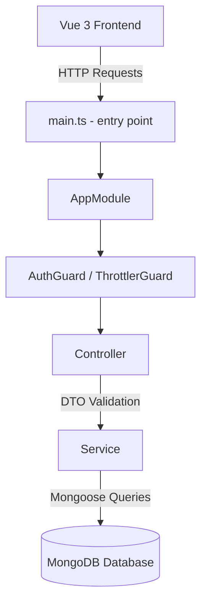

# 📚 TRƯỜNG THÀNH BOOKSTORE — TÀI LIỆU DỰ ÁN CHI TIẾT
*(Tài liệu dành cho AI và Nhà phát triển để đọc hiểu nhanh toàn bộ hệ thống)*

Hệ thống bán hàng và quản trị Trường Thanh Bookstore được xây dựng trên mô hình Client-Server hiện đại, đáp ứng đầy đủ các tiêu chuẩn bảo mật, tối ưu hóa hiệu năng, và trải nghiệm người dùng (UX) cao cấp.

---

## 📂 1. SƠ ĐỒ CẤU TRÚC THƯ MỤC DỰ ÁN (PROJECT STRUCTURE)

### 1.1. Cấu trúc Backend (NestJS BE)
```
backend/
├── src/
│   ├── main.ts                        # Khởi tạo ứng dụng NestJS, thiết lập CORS, Pipes, Filters
│   ├── app.module.ts                  # Root Module kết nối Mongoose, Config và Throttler (Rate Limit)
│   ├── common/                        # Chứa các tiện ích dùng chung
│   │   ├── decorators/                # Decorator tùy chỉnh (ví dụ: @GetUser lấy thông tin user từ JWT)
│   │   ├── dto/                       # DTO dùng chung cho phân trang (PaginationDto)
│   │   ├── enums/                     # Định nghĩa Enum hệ thống (UserRole, OrderStatus, DiscountType)
│   │   ├── filters/                   # HttpExceptionFilter chuẩn hóa cấu trúc lỗi API trả về
│   │   ├── guards/                    # Guard xác thực quyền (OptionalJwtGuard)
│   │   └── interceptors/              # TransformInterceptor bọc kết quả API thành { statusCode, message, data }
│   ├── modules/                       # Các Module Nghiệp vụ chính
│   │   ├── auth/                      # Đăng ký, đăng nhập, JWT, mã hóa bcrypt và làm sạch profile
│   │   ├── categories/                # Quản lý danh mục sản phẩm (hỗ trợ phân cấp Cha - Con)
│   │   ├── customers/                 # Quản lý thông tin khách hàng (phần Admin hiển thị)
│   │   ├── inventory/                 # Quản lý nhập/xuất/điều chỉnh kho, ghi log giao dịch
│   │   ├── landing-pages/             # Thiết lập và tuỳ biến trang đích khuyến mãi (Landing Pages)
│   │   ├── orders/                    # Xử lý đơn hàng, khoá giá, tính ship server-side, kiểm kho nguyên tử
│   │   ├── products/                  # Quản lý sách/văn phòng phẩm & lưu trữ bình luận (Reviews) dưới DB
│   │   ├── promotions/                # Hệ thống mã giảm giá (voucher), chặn dùng trùng, giới hạn tối đa
│   │   └── reports/                   # Thống kê doanh thu theo múi giờ địa phương, báo cáo Dashboard
│   └── seeds/                         # Dữ liệu mẫu (Seed Data) dùng để khởi tạo nhanh hệ thống
├── package.json                       # Quản lý thư viện phụ thuộc của NestJS
└── tsconfig.json                      # Cấu hình TypeScript Compiler cho Backend
```

### 1.2. Cấu trúc Frontend (Vue 3 FE)
```
frontend/
├── src/
│   ├── main.ts                        # Điểm khởi chạy ứng dụng Vue 3, nạp router, pinia, toast
│   ├── App.vue                        # Root Component chính chứa <router-view />
│   ├── style.css                      # Chứa Tailwind CSS và custom styles
│   ├── assets/                        # Tài nguyên tĩnh (ảnh danh mục, logo, background sale)
│   ├── components/                    # Component dùng lại (ProductCard, ProfileModal)
│   ├── layouts/                       # Layout bao bọc giao diện (CustomerLayout, AdminLayout)
│   ├── composables/                   # Khai báo Composition API dùng chung (useScrollReveal)
│   ├── pages/                         # Chứa các trang View của hệ thống
│   │   ├── NotFound.vue               # Trang thông báo lỗi 404
│   │   ├── customer/                  # Giao diện phía khách hàng (Home, Cart, Checkout, ProductDetail,...)
│   │   └── admin/                     # Giao diện phía quản trị (Dashboard, Inventory, Orders, Promotions,...)
│   ├── router/                        # Cấu hình định tuyến Vue Router, Lazy Loading và Guards
│   ├── services/                      # Cấu hình Axios Client kết nối API Backend
│   ├── stores/                        # Pinia Stores quản lý state tập trung (auth.ts, cart.ts)
│   ├── types/                         # Định nghĩa kiểu dữ liệu TypeScript (Product, Order, User,...)
│   └── utils/                         # Hàm trợ giúp (formatCurrency, mã hóa JWT localStorage, helper date)
├── package.json                       # Quản lý thư viện phụ thuộc của Frontend
└── vite.config.ts                     # File cấu hình đóng gói và tối ưu của Vite
```

---

## 🛠 2. CÔNG NGHỆ SỬ DỤNG (TECH STACK)
*   **Backend (Server)**:
    *   **Framework**: [NestJS](https://nestjs.com/) (Node.js framework)
    *   **Cơ sở dữ liệu**: MongoDB
    *   **ODM**: Mongoose
    *   **Thư viện hỗ trợ**: `@nestjs/jwt`, `@nestjs/throttler` (Rate limit), `bcrypt` (Mã hóa mật khẩu), `class-validator` & `class-transformer` (Validate DTO).
*   **Frontend (Client)**:
    *   **Framework**: [Vue 3](https://vuejs.org/) (SFC - Single File Component, Composition API)
    *   **Bundler**: Vite
    *   **State Management**: Pinia
    *   **Routing**: Vue Router
    *   **Styling**: TailwindCSS
    *   **Thư viện vẽ biểu đồ**: Chart.js / Vue-Chartjs
    *   **Thông báo UI**: Vue-Toastification

---

## 🏗 3. KIẾN TRÚC HỆ THỐNG & ĐIỀU PHỐI (ARCHITECTURE)

Hệ thống tuân thủ kiến trúc phân tầng chuẩn của NestJS:


*   **Global Filters & Pipes**:
    *   `HttpExceptionFilter`: Đồng bộ hóa định dạng lỗi trả về từ API cho toàn hệ thống.
    *   `TransformInterceptor`: Chuẩn hóa dữ liệu trả về theo form `{ statusCode, message, data }`.
    *   `ValidationPipe`: Tự động loại bỏ các field lạ (`whitelist: true`) và bắt lỗi dữ liệu đầu vào (`class-validator`).

---

## 🗄 4. THIẾT KẾ CƠ SỞ DỮ LIỆU (DATABASE SCHEMAS)

### 4.1. User Schema (`users`)
Quản lý tài khoản khách hàng, nhân viên, và quản trị viên.
*   `fullName`: Chuỗi (Bắt buộc).
*   `email`: Chuỗi (Duy nhất, bắt buộc, định dạng email).
*   `password`: Chuỗi (Lưu hash bcrypt).
*   `phone`: Chuỗi (10 chữ số, bắt đầu bằng 0).
*   `role`: Enum (`CUSTOMER`, `STAFF`, `ADMIN`).
*   `avatar`: Chuỗi (URL ảnh từ Cloudinary).
*   `isDeleted`: Boolean (Hỗ trợ soft-delete).

### 4.2. Product Schema (`products`)
*   `name`: Chuỗi (Bắt buộc).
*   `slug`: Chuỗi (Duy nhất, tạo tự động kèm đuôi random 4 kí tự chống trùng lặp).
*   `description`: Chuỗi.
*   `price`: Số (Giá bán gốc).
*   `discountPrice`: Số (Giá sau giảm, mặc định 0).
*   `stock`: Số (Số lượng tồn kho thực tế).
*   `images`: Mảng Chuỗi.
*   `brand`: Chuỗi.
*   `sku`: Chuỗi (Mã sản phẩm duy nhất).
*   `rating`: Số (Trung bình đánh giá từ 1 đến 5).
*   `sold`: Số (Số lượng đã bán).
*   `status`: Enum (`ACTIVE`, `INACTIVE`).
*   `category`: ObjectId ref `categories`.
*   `isFeatured`: Boolean.
*   `isDeleted`: Boolean.

### 4.3. Review Schema (`reviews`)
Lưu trữ đánh giá sản phẩm của người dùng và đã được chuyển thành persistence lưu trong DB.
*   `product`: ObjectId ref `products`.
*   `user`: ObjectId ref `users`.
*   `name`: Chuỗi.
*   `rating`: Số (1 đến 5).
*   `content`: Chuỗi (Bắt buộc).

### 4.4. Category Schema (`categories`)
*   `name`: Chuỗi.
*   `parentId`: ObjectId (Tự liên kết cấp danh mục cha - con).
*   `image`: Chuỗi.
*   `slug`: Chuỗi.
*   `isDeleted`: Boolean.

### 4.5. Order Schema (`orders`)
*   `orderCode`: Chuỗi (Mã đơn hàng duy nhất dạng `TTB-XXXXXX`).
*   `customer`: ObjectId ref `users` (Optional - Hỗ trợ Guest Checkout).
*   `customerName`: Chuỗi.
*   `email`: Chuỗi.
*   `phone`: Chuỗi.
*   `shippingAddress`: Chuỗi.
*   `items`: Mảng sub-document:
    *   `product`: ObjectId ref `products`.
    *   `name`: Chuỗi.
    *   `quantity`: Số.
    *   `price`: Số (Giá được khóa tại thời điểm đặt đơn).
    *   `image`: Chuỗi.
*   `subtotal`: Số.
*   `shippingFee`: Số.
*   `discountAmount`: Số.
*   `total`: Số.
*   `promotionCode`: Chuỗi.
*   `paymentMethod`: Enum (`COD`, `BANK_TRANSFER`, `EWALLET`).
*   `paymentStatus`: Enum (`PENDING`, `PAID`).
*   `orderStatus`: Enum (`PENDING`, `CONFIRMED`, `SHIPPING`, `COMPLETED`, `CANCELLED`).
*   `notes`: Chuỗi.

### 4.6. Inventory & InventoryTransaction (`inventories`, `inventorytransactions`)
*   **Inventory**: Lưu trữ và cập nhật trạng thái kho.
    *   `product`: ObjectId ref `products`.
    *   `currentStock`: Số.
    *   `minStock`: Số (Mặc định 10 để kích hoạt cảnh báo Low Stock).
    *   `status`: Enum (`IN_STOCK`, `LOW_STOCK`, `OUT_OF_STOCK`).
*   **InventoryTransaction**: Nhật ký điều chỉnh kho.
    *   `product`: ObjectId ref `products`.
    *   `type`: Enum (`IMPORT`, `EXPORT`, `ADJUST`).
    *   `quantity`: Số.
    *   `note`: Chuỗi.
    *   `createdBy`: ObjectId ref `users`.

---

## 💡 5. CÁC MODULE CHI TIẾT & LOGIC BÊN TRONG

### 5.1. Module Xác thực (Authentication)
*   **Token Expiry & Security**: JWT Access Token sử dụng thời gian hết hạn (`expiresIn: '7d'`). 
*   **LocalStorage Encryption**: Frontend sử dụng hàm mã hóa và giải mã `encryptToken()` / `decryptToken()` khi lưu dữ liệu nhạy cảm (`token`, `user`) vào `localStorage` của trình duyệt nhằm ngăn chặn lộ thông tin dạng thô.
*   **Profile Clean**: API `/api/auth/me` tự động loại bỏ trường hash mật khẩu `password` bằng cách destructure trả về (`const { password, ...safeUser } = user`).

### 5.2. Module Đặt hàng & Thanh toán (Checkout & Order)
*   **Recalculation on Backend (Chống Price Manipulation)**: Khi khách hàng tạo đơn hàng, backend **không tin tưởng** vào giá tiền và phí vận chuyển gửi lên từ client.
    1.  Duyệt qua mảng `items` gửi lên, dùng `productsService.findById(item.product)` để lấy thông tin sản phẩm và giá thực trực tiếp từ Database.
    2.  Tính toán lại `subtotal` bằng giá thật này.
    3.  Tính toán lại `shippingFee` dựa trên điều kiện: Đơn hàng `>= 299.000đ` được miễn phí vận chuyển, ngược lại phí ship là `30.000đ`.
    4.  Áp dụng voucher (nếu có) để tính lại `discountAmount`.
    5.  Tính ra tổng tiền cuối cùng `total = subtotal + shippingFee - discount`.
*   **Atomic Stock Check & Deduct**: Để ngăn chặn race condition khiến kho bị âm khi nhiều người đặt hàng cùng lúc, hệ thống sử dụng truy vấn nguyên tử (atomic query) của MongoDB:
    ```typescript
    const updated = await this.productModel
      .findOneAndUpdate(
        { _id: id, stock: { $gte: quantity } }, // Kiểm tra stock lớn hơn hoặc bằng lượng mua
        { $inc: { stock: -quantity } },
        { new: true },
      ).exec();
    ```
    Nếu không tìm thấy hoặc số lượng tồn không đủ, trả về `BadRequestException` lập tức để huỷ quá trình tạo đơn.
*   **Ownership Check on Cancellation**: Người dùng chỉ được hủy đơn hàng của chính họ. Controller kiểm tra tính sở hữu trước khi cập nhật trạng thái đơn:
    ```typescript
    if (order.customer.toString() !== req.user._id && req.user.role !== UserRole.ADMIN) {
      throw new ForbiddenException('Bạn không có quyền huỷ đơn hàng này');
    }
    ```

### 5.3. Module Khuyến mại & Voucher (Promotions)
*   **Max Discount Capping**: Hỗ trợ giảm giá theo phần trăm kèm giới hạn tối đa (`maxDiscount`). 
    ```typescript
    if (promo.discountType === DiscountType.PERCENT) {
      discount = Math.floor((orderTotal * promo.discountValue) / 100);
      if (promo.maxDiscount && promo.maxDiscount > 0) {
        discount = Math.min(discount, promo.maxDiscount);
      }
    }
    ```
*   **Usage Frequency Check**: Ngăn chặn người dùng sử dụng cùng 1 coupon cho nhiều đơn hàng:
    Hệ thống kiểm tra xem user hiện tại đã có đơn hàng nào không bị hủy (`status != CANCELLED`) đã dùng mã này chưa.

### 5.4. Module Tìm kiếm & An toàn (Search & ReDoS Protection)
*   **ReDoS Prevention**: Người dùng nhập chuỗi tìm kiếm dài có thể dẫn đến đứng CPU server nếu sử dụng Regex không an toàn. Hệ thống giới hạn chuỗi tìm kiếm đầu vào tối đa là 100 ký tự:
    `const safeQ = q.substring(0, 100);`
*   **Diacritic-Insensitive Matching**: Tạo một bản đồ ký tự có dấu (Tiếng Việt) sang không dấu để biến chuỗi nhập thành một Regex Pattern linh hoạt, cho phép tìm kiếm bất kể người dùng gõ có dấu hay không dấu.

### 5.5. Module Báo cáo (Reports)
*   **Timezone Offset Fix**: Để đảm bảo báo cáo doanh thu theo ngày là chính xác tuyệt đối mà không bị lệch múi giờ UTC, backend chuyển đổi tham số lọc ngày cụ thể:
    ```typescript
    const start = new Date(startDate);
    start.setHours(0, 0, 0, 0); // Bắt đầu ngày theo giờ địa phương
    const end = new Date(endDate);
    end.setHours(23, 59, 59, 999); // Kết thúc ngày theo giờ địa phương
    ```
    Phía client cũng lấy giá trị thông qua hàm bổ trợ `getLocalDateString(date)` thay vì `date.toISOString()`.

---

## 🔒 6. CÁC BIỆN PHÁP BẢO MẬT & TỐI ƯU ĐÃ TRIỂN KHAI

1.  **Rate Limiting**: Giới hạn tần suất gửi yêu cầu lên các API xác thực (Login/Register) bằng `@nestjs/throttler` (Mặc định 100 requests/phút).
2.  **CORS Security**: Hỗ trợ cấu hình đa domain động qua biến môi trường `FRONTEND_URL` (hỗ trợ phân tách bằng dấu phẩy) thay vì dùng wildcard `*`.
3.  **Input Sanitation**: Bắt buộc mọi API đầu vào phải được định nghĩa bằng class DTO và đi qua ValidationPipe của NestJS để tránh SQL/NoSQL Injection qua các payload bất thường.
4.  **UI Performance**: Toàn bộ hệ thống routes ở Frontend đều được cấu hình tải chậm (Lazy Loading) giúp giảm dung lượng bundle tải về ban đầu của người dùng.
